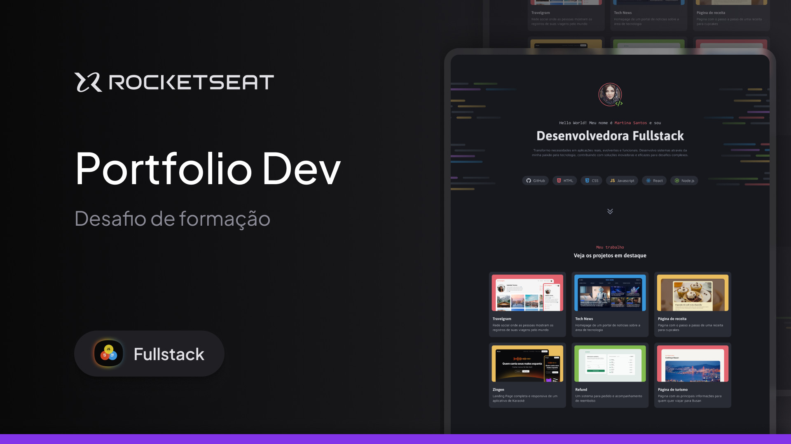

# Portfolio Dev

Projeto do curso de Full-Stack da RocketSeat focado em um website portfolio profissional moderno e responsivo.

## Screenshots

---

## 🚀 Tecnologias

Este projeto foi desenvolvido com as seguintes tecnologias:

- HTML5
- CSS3
- Google Fontes (Asap, Inconsolata, Maven Pro)

## 💻 Projeto

O Portfolio Dev é um website pessoal que inclui:

- Seção de introdução com foto de perfil e descrição profissional
- Carrossel de tecnologias e habilidades
- Showcase de projetos em destaque
- Seção de contato e redes sociais

## 🎨 Layout

O layout foi desenvolvido com foco em:

- Design moderno e minimalista
- Responsividade para diferentes dispositivos
- Acessibilidade com elementos semânticos
- Experiência de usuário intuitiva

## 🌐 Como Acessar

Clique [aqui](https://busolinkz.github.io/portfolio-challenge/) para acessar o site online.

Alternativamente, pode ser acessado localmente seguindo estes passos:

1. Clone o repositório
2. Abra o arquivo `index.html` em seu navegador

## 📝 Licença

Este projeto está sob a licença MIT.

## 💻 Autor
[@busolinkz](https://github.com/busolinkz)
